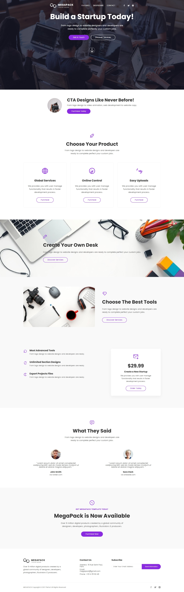

# 🚀 MEGAPACK Landing Page

[🔗 Live Demo](https://merna112.github.io/Megapack/)

**MEGAPACK** is a responsive, modern, and visually appealing HTML/CSS landing page template tailored for startups, freelancers, and creative service providers.

## 📌 Project Features

- **Hero Section with CTA Buttons**  
  Eye-catching full-height hero section with two clear call-to-action buttons:  
  - _"Get In Touch"_  
  - _"Discover Services"_

- **Navigation with Logo and Social Icons**  
  Clean navigation bar including:  
  - Scalable SVG logo  
  - Navigation links: `Features`, `Dropdown`, `Contact`  
  - Social media icons: Facebook, Twitter, Instagram (with hover effects)

- **Animated Scroll Icon**  
  Bouncing scroll indicator encouraging users to explore more.

- **Service-Based Call-To-Action (CTA) Section**  
  Compact section featuring:  
  - Rounded product image  
  - Heading, description, and primary purchase button

- **Product Cards Section**  
  Grid of three product cards with SVG icons:  
  - Global Services  
  - Online Control  
  - Easy Uploads

- **Image-Based Feature Section**  
  Full-width background image with overlay content promoting custom desk solutions.

- **Alternating Feature Section with Image and Text**  
  Reversed layout section emphasizing tool choice with engaging visuals.

- **Tools & Pricing Section**  
  - Three tool highlights with icons and descriptions  
  - Single pricing card (`$29.99`) with title: _"Create a New Startup"_ and order button

- **Testimonials Section**  
  Two testimonial cards featuring:  
  - Circular avatar image  
  - Quote text  
  - Author name and source (Twitter / Dribbble)

- **Final CTA Section**  
  Large promo section with heading: _"MegaPack is Now Available"_ and a bold "Purchase Now" button

- **Footer with Contact Info & Subscription**  
  Footer includes:  
  - About MEGAPACK description and SVG logo  
  - Contact info (address, email, phone)  
  - Email subscription form with styled button  
  - Bottom bar with copyright  
  - Social icons in grayscale with hover effect

## 🛠️ Built With

- **HTML5**
- **CSS3 (Custom + Variables)**
- Responsive design with `flexbox`, `grid`, `media queries`
- SVG icons and illustrations (inline & external)

## 📸 Assets Used

- **Images from**: Unsplash, RandomUser.me  
- **Icons from**: Icons8, Tabler Icons (SVGs)

## 💼 Suitable For

- Creative startups  
- Digital product portfolios  
- Marketing campaigns  
- Freelancers and agencies

---

> **Note:** This is a static HTML/CSS template, with no JavaScript included. All interactive elements (like hover/animations) are CSS-based.
